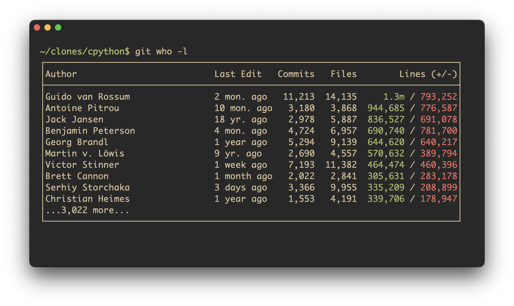

# git-who
 

`git-who` is a command-line tool for answering that age-old question:

> _Who wrote this code??_

`git-who` is like `git blame` but for file trees, i.e. directories and their
contents. Whereas `git blame` tells you who wrote a _line_ of code, `git-who`
tries to identify the primary authors of an entire component or subsystem in a
codebase.

## Usage
_(In the following examples, `git-who` is invoked as `git who`, which requires
setting up a Git alias. See the alias section below.)_

`git-who` has three subcommands. Each subcommand gives you a different view of
authorship in your Git repository.

### The `table` Subcommand
The `table` subcommand is the default subcommand. Because it is the default,
you can invoke it explicitly as `git who table` or implicitly just as `git
who`.

The `table` subcommand prints a table summarizing the contributions of every
author who has made commits in the repository.

```
$ git who
┌─────────────────────────────────────────────────────┐
│Author                            Last Edit   Commits│
├─────────────────────────────────────────────────────┤
│Junio C Hamano                     19 hr. ago    7993│
│Jeff King                          3 days ago    4421│
│Johannes Schindelin               2 weeks ago    2221│
│Ævar Arnfjörð Bjarmason            1 year ago    1944│
│Nguyễn Thái Ngọc Duy                5 yr. ago    1801│
│Patrick Steinhardt                 2 days ago    1247│
│Shawn O. Pearce                    11 yr. ago    1220│
│Elijah Newren                     1 month ago    1163│
│René Scharfe                       5 days ago    1161│
│Linus Torvalds                      2 yr. ago    1097│
│...2243 more...                                      │
└─────────────────────────────────────────────────────┘
```

The `-m`, `-l`, and `-f` flags allow you to sort this table by different
metrics.

You can use the `-m` flag to sort (in descending order) by the "Last
Edit" column. This shows the most recent commiters in the repository.

The `-l` flag sorts the table by number of lines modified:

```
$ git who -l
┌──────────────────────────────────────────────────────────────────────────────┐
│Author                           Last Edit   Commits   Files       Lines (+/-)│
├──────────────────────────────────────────────────────────────────────────────┤
│Jiang Xin                        8 mon. ago      331     471  253283 /  226023│
│Junio C Hamano                   19 hr. ago     7993    2492  247398 /  105550│
│Peter Krefting                   3 mon. ago      122     564  160447 /  135430│
│Tran Ngoc Quan                   2 yr. ago        84     296  148753 /  126581│
│Alexander Shopov                 1 week ago       82     298  143828 /  114936│
│Jordi Mas                        2 mon. ago       59     222  110952 /   95889│
│Jean-Noël Avila                  1 month ago     126     383   96875 /   90328│
│Ralf Thielow                     2 mon. ago      166     470   88881 /   64093│
│Dimitriy Ryazantcev              1 year ago       30     279   84741 /   62953│
│Jeff King                        3 days ago     4421    2056   86235 /   47464│
│...2243 more...                                                               │
└──────────────────────────────────────────────────────────────────────────────┘
```

The `-f` flag sorts the table by the number of files modified.

Note that the `-l` and `-f` flags, which require a more involved walk of the
commit history, can take several seconds to run in large repositories. This is
true only when running the command over the entire Git log--see the Filtering
Commits section below for how to restrict `git-who` to a subset of the commit
history.

## The `tree` Subcommand
TODO.

## The `hist` Subcommand
TODO.

## DEVELOPMENT
### Test Repository Submodule
Some of the automated tests for `git-who` need to run against a Git repository.
A test repository is attached to this repository as a submodule.

If you want to run the automated tests, you will first need to set up the
submodule:

```
$ git submodule update --init
```
